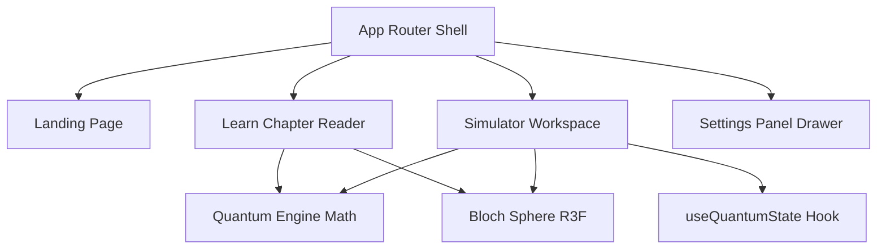

# 🛠️ QubitScope V1.0 – Developer & Architecture Guide

This document provides a comprehensive technical overview of QubitScope's codebase, data model, state management hooks, and rendering pipeline. It is designed to assist developers and future contributors in extending the simulator or implementing new educational features.

---

## 🏗️ 1. High-Level Architecture

QubitScope is designed as a client-side single-page application (SPA). There is no backend service, database, or API request footprint. The client computes all math transformations, renders WebGL meshes, and handles routing.



---

## 🧮 2. Quantum Core Engine (`src/engine/quantumEngine.ts`)

The quantum engine handles the complex algebra and matrix mathematics of a single quantum bit. It is decoupled from all UI elements to allow easy unit testing and maintainability.

### Data Types
* **`Complex`**: Represented as a plain JavaScript object `{ re: number, im: number }`.
* **`StateVector`**: A two-element array `[Complex, Complex]` representing:
  $$|\psi\rangle = \begin{pmatrix} \alpha \\ \beta \end{pmatrix}$$
* **`BlochVector`**: Represents coordinates $(x, y, z)$ on the unit sphere.

### Primary Routines
1. **`complex(re, im)`**: Helper constructor.
2. **`add(c1, c2)`**, **`multiply(c1, c2)`**: Basic complex number arithmetic.
3. **`applyGateToState(state, gateType, theta)`**: Computes the unitary product $U |\psi\rangle$. It contains hardcoded matrix transformations for gates:
   * **X**: Flipping elements.
   * **Y**: Multiplication by complex unit $i$.
   * **Z**: Inversion of phase components.
   * **H**: Projection into superpositions:
     $$\alpha_{new} = \frac{\alpha + \beta}{\sqrt{2}}, \quad \beta_{new} = \frac{\alpha - \beta}{\sqrt{2}}$$
   * **Rotations ($R_x, R_y, R_z$)**: Uses Euler angle parameterized coefficients using sine and cosine values.
4. **`getBlochVector(state)`**: Translates a state vector $[ \alpha, \beta ]$ into Cartesian coordinates $(x, y, z)$.
5. **`getProbabilities(state)`**: Computes:
   $$P(|0\rangle) = |\alpha|^2, \quad P(|1\rangle) = |\beta|^2$$
6. **`collapseState(state, outcome)`**: Projects the state vector onto either $|0\rangle$ or $|1\rangle$ to simulate Born-rule collapses.

---

## ⚓ 3. State Management Hook (`src/hooks/useQuantumState.ts`)

The React state is centralized inside the custom hook `useQuantumState`. It acts as the primary controller for the workspace simulation dashboard:

* **State Variables:**
  * `statevector`: Current `StateVector` values.
  * `history`: Array of past actions (gate name, timestamp, and resulting coordinates) that drives the visual workspace pipeline.
* **Handlers:**
  * `applyGate(gateType, theta)`: Applies the unitary operation, appends a record to the logs history track, and normalizes resulting amplitudes to prevent floating-point precision drifts.
  * `measure()`: Computes Born-rule probabilities, pulls a random number, collapses the state vector accordingly, and locks history events.
  * `reset()`: Resets the state vector back to $|0\rangle$.

---

## 🌐 4. 3D Bloch Rendering Pipeline (`src/components/bloch/`)

The 3D Bloch sphere uses a Three.js Canvas managed through React Three Fiber (R3F) and `@react-three/drei`.

### Coordinate Transformations
* **Pauli Axis mapping:** Quantum polar coordinates $Z$ point vertically (North Pole $|0\rangle$, South Pole $|1\rangle$). Three.js uses $Y$ as the vertical axis.
* **Mapping rule:** Quantum coordinates $(x, y, z)$ are mapped to Three.js coordinates $(x, z, y)$ to ensure that Three.js OrbitControls behave intuitively while keeping the sphere's North Pole on the vertical axis.

### Render Loop & Damping
The state vector is animated inside the `useFrame` render loop:
```typescript
const speed = Math.min(10 * settings.animationSpeed * delta, 0.15 * settings.animationSpeed);
const nextVec = currentVec.clone().lerp(targetThreeVec, speed);
```
On every frame, the vector is normalized to force it to slide along the outer shell surface rather than clipping through the core of the sphere.

---

## 📖 5. Educational Data Layout (`src/data/educationData.ts`)

The content of the learning tabs and tutorials is decoupled into a structured JSON configuration layout to easily modify text:

* **`LEARN_CHAPTERS`**: An array of 6 chapter records. Each record contains:
  * `id`: Progression ID.
  * `title`: Chapter header.
  * `beginnerContent`: Paragraph list simplified for novice users.
  * `advancedContent`: Paragraph list containing linear algebra and LaTeX equations.
  * `interactivePreset`: A configuration object defining which gates to pre-load inside the chapter sandbox (e.g. applying H in Chapter 4).
  * `takeaways`: bullet-point review lists.
* **`GATE_ENCYCLOPEDIA`**: Descriptions, difficulties, matrix representations, and real-world applications for each quantum gate.
* **`GLOSSARY`**: A searchable lookup list of quantum terminology with dual mode descriptions.

---

## 🔧 6. Future Extensibility

### Adding a New Quantum Gate
1. Open [src/types/quantum.ts](file:///c:/Users/mamid/OneDrive/Documents/VS%20Code/QubitScope/src/types/quantum.ts) and add the gate identifier to `GateType`.
2. Open [src/engine/quantumEngine.ts](file:///c:/Users/mamid/OneDrive/Documents/VS%20Code/QubitScope/src/engine/quantumEngine.ts) and update the `applyGateToState` switch block to define the matrix transformation.
3. Open [src/data/educationData.ts](file:///c:/Users/mamid/OneDrive/Documents/VS%20Code/QubitScope/src/data/educationData.ts) and add the card details to `GATE_ENCYCLOPEDIA`.
4. Open [src/components/simulator/GateControls.tsx](file:///c:/Users/mamid/OneDrive/Documents/VS%20Code/QubitScope/src/components/simulator/GateControls.tsx) and add a button trigger for the new gate.

### Implementing Multi-Qubit Support (V2.0 Core Idea)
* To expand the engine to $N$ qubits, the state vector length must increase to $2^N$.
* The unitary operators must be expanded to $2^N \times 2^N$ matrices using Kronecker tensor products.
* The 3D Bloch sphere cannot easily represent multiple qubits due to entanglement phase connections, so a state vector grid visualization or a quantum circuit wire interface would be required alongside it.
