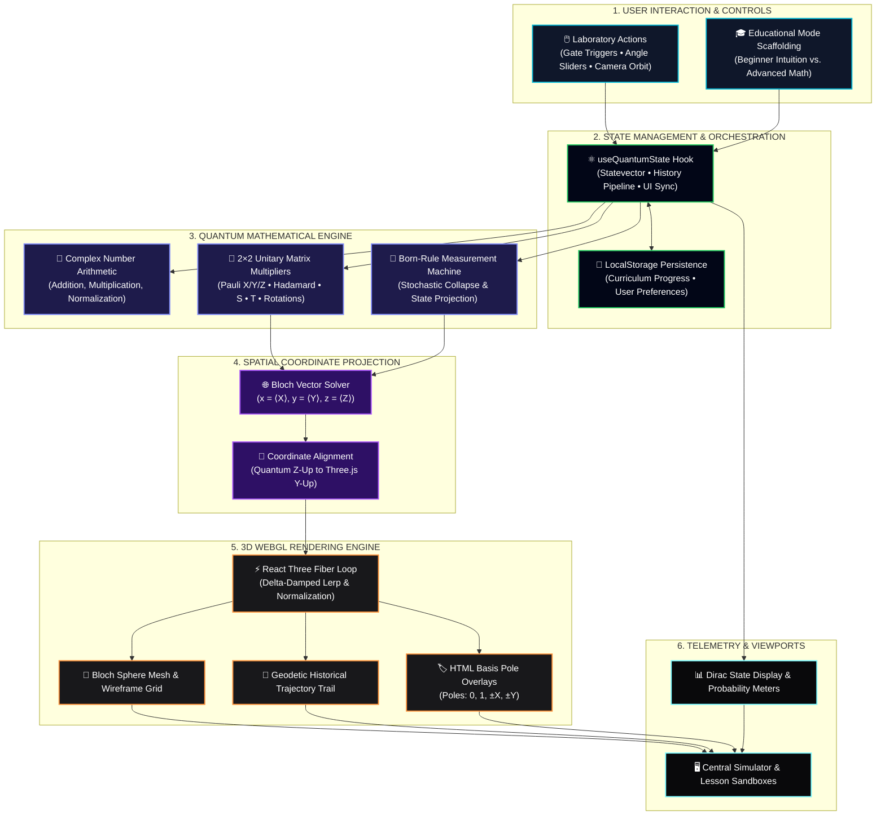
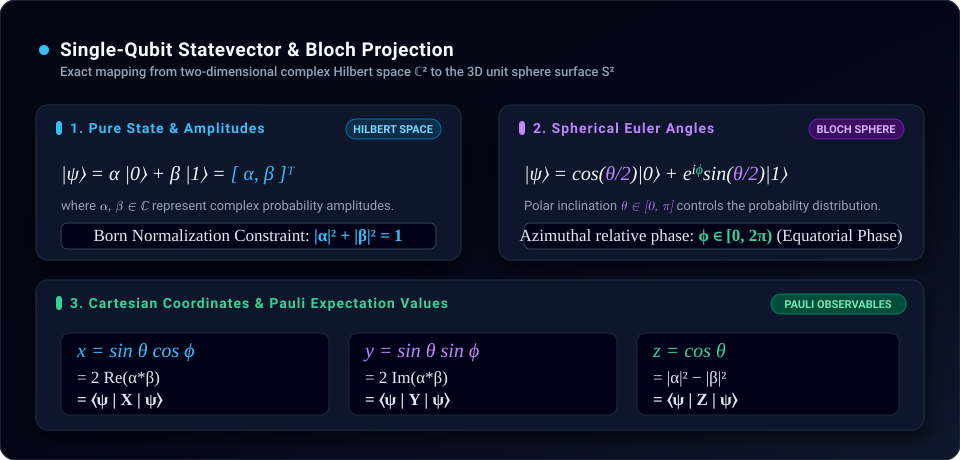
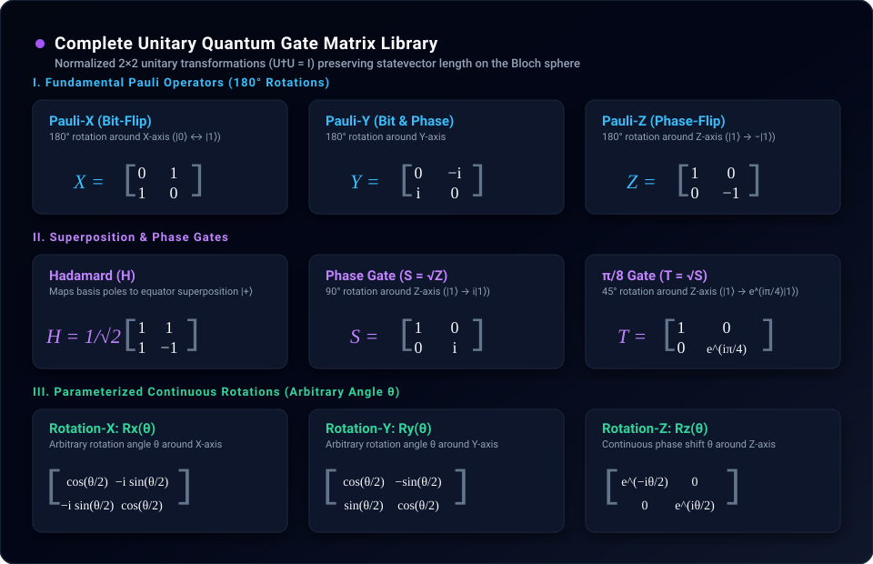

<div align="center">

# ✦ QubitScope
### *Interactive Quantum Computing Learning Platform & 3D Virtual Laboratory*

**An open, interactive educational platform designed to build genuine physical and mathematical intuition for single-qubit quantum computing.**

[](https://threejs.org/)
[](https://react.dev/)
[](https://www.typescriptlang.org/)
[](https://tailwindcss.com/)
[](https://vite.dev/)
[](./LICENSE)

[](https://qubitscope.vercel.app/)

[Overview](#overview) • [Highlights](#highlights) • [Pillars](#pillars) • [Curriculum](#curriculum) • [Controls](#controls) • [Architecture](#architecture) • [Math & Gates](#math) • [Quickstart](#quickstart)

</div>

---

<a id="overview"></a>
## 🧭 What is QubitScope? & Why It Exists

**QubitScope** is an interactive, client-side quantum simulation laboratory and learning platform engineered to make single-qubit quantum mechanics visual, intuitive, and mathematically rigorous.

Quantum computing is notoriously difficult to learn because its core mathematical representations—complex probability amplitudes, Hilbert space statevectors, and non-commutative matrix operators—exist in abstract spaces that cannot be observed directly. Traditional educational resources often struggle with two extremes:
* **The Metaphor Trap:** Explaining qubits simply as *"coins that are both heads and tails at the same time"*, which fails to convey phase, constructive/destructive interference, or state evolution.
* **The Formalism Wall:** Overwhelming beginners with abstract linear algebra proofs, tensor spaces, and complex matrices before establishing any physical or geometric intuition.

**QubitScope bridges this gap by grounding abstract linear algebra in tangible 3D geometry.** By projecting complex amplitudes directly onto the surface of the Bloch sphere, learners can interactively rotate states, observe constructive and destructive phase relationships, and witness stochastic measurement collapses in real time.

---

<a id="highlights"></a>
## 🌟 Key Highlights

> **🎓 Complete Visual Learning Platform**  
> Moves beyond static textbooks and video lectures by combining structured, self-paced lessons with real-time, interactive 3D simulations.
>
> **🔮 Continuous 3D Geodetic Trajectories**  
> Projects 2D complex probability amplitudes $(\alpha, \beta)$ directly onto the unit Bloch sphere with dynamic trails that trace physical phase rotations and state evolution without numerical drift.
>
> **⚡ Client-Side Simulation Laboratory**  
> Runs entirely in modern browsers via WebGL & TypeScript. Provides instant interactive feedback with zero server delays, cloud dependencies, or software installation.
>
> **🔄 Dual-Horizon Cognitive Scaffolding**  
> Dynamically adapts the entire application copy between **Beginner Mode** (geometric analogies and intuitive descriptions) and **Advanced Mode** (Dirac bra-ket notations, Euler angles, and unitary matrices).

---

<a id="pillars"></a>
## 🏛️ The Three Platform Pillars

QubitScope is structured into three integrated educational environments designed to support learners at every stage of their journey:

### ── 01. The Virtual 3D Quantum Laboratory (Simulation Deck)
An open workbench for free-form experimentation and hypothesis testing:
* **Interactive 3D Bloch Canvas:** Fluid 360° camera orbit and zoom navigation to inspect basis poles, equator phases, and spherical coordinates.
* **Unitary Gate Matrix:** Instant triggers for standard single-qubit gates ($X, Y, Z, H, S, T$) and parameterized continuous rotations ($R_x, R_y, R_z$).
* **Born-Rule Measurement Machine:** Stochastic state collapse to basis poles $\vert 0\rangle$ or $\vert 1\rangle$ based on exact quantum probabilities.
* **Live Mathematical Telemetry:** Real-time statevector readout $\vert\psi\rangle = \alpha\vert 0\rangle + \beta\vert 1\rangle$, probability gauges, and Cartesian Pauli expectation values $(\langle X \rangle, \langle Y \rangle, \langle Z \rangle)$.
* **Chronological State Pipeline:** Traceable operation history log tracking every applied gate with instant one-click ground state $\vert 0\rangle$ resets.

### ── 02. The Guided Curriculum & Micro-Sandboxes (Learning Deck)
A progressive, 6-chapter learning pathway that builds understanding step-by-step:
* **Structured Lesson Flow:** Takes learners from classical binary foundations to superposition, quantum phase, and measurement dynamics.
* **In-Situ 3D Sandboxes:** Chapters 1–5 embed localized, interactive mini-Bloch spheres directly beside lesson paragraphs with pre-configured single-click gate sequence routines.
* **Persistent Progress Tracking:** Automatically saves completed chapter milestones in browser storage, lighting up a visual curriculum roadmap.

### ── 03. The Quantum Knowledge Base & Reference Deck
A built-in reference ecosystem ensuring learners never need to leave the platform to look up definitions:
* **Gate Encyclopedia:** Dedicated cards detailing operational purposes, mathematical representations, physical rotation mechanics, and real-world quantum computing hardware applications (superconducting qubits, trapped ions, photonics).
* **Searchable Quantum Dictionary:** Contextual glossary defining core terminology (Amplitude, Phase, Superposition, Coherence, Unitary Operator, Measurement Collapse).
* **Reference Modal Sheet:** Quick-access modal displaying foundational equations, coordinate derivations, and unitary matrix transformations.

---

<a id="curriculum"></a>
## 📖 Curriculum Roadmap & Learning Outcomes

| Chapter | Core Concept | In-Situ Interactive Sandbox Exercise | Key Takeaway |
| :---: | :--- | :--- | :--- |
| **01** | **Classical vs. Qubit** | Inspect ground state $\vert 0\rangle$ and flip to $\vert 1\rangle$ via Pauli-X | Qubits hold continuous complex probability amplitudes, not just binary values. |
| **02** | **The Bloch Sphere** | Orbit the 3D sphere and inspect Cartesian coordinates $(x, y, z)$ | Pure quantum states map to exact points on the surface of a 3D unit sphere. |
| **03** | **Quantum Gates** | Apply bit-flips ($X$) and phase-flips ($Z$) to observe vector paths | Quantum gates are norm-preserving, reversible unitary rotations. |
| **04** | **Superposition & Phase** | Apply Hadamard ($H$) followed by Phase ($S$) along the equator | Superposition enables relative phase $\phi$, the key driver of quantum interference. |
| **05** | **Measurement Collapse** | Trigger repeated measurements on equal superposition states | Observation irreversibly collapses a quantum state into classical information. |
| **06** | **Self-Guided Lab** | Execute custom multi-gate sequences and track historical trails | Combining rotations builds intuition for quantum circuit design. |

---

<a id="scaffolding"></a>
## 🔄 Dual-Horizon Cognitive Scaffolding

QubitScope features a global educational mode switch that instantly re-anchors the entire application copy between conceptual intuition and mathematical rigor:

| Concept | Beginner Mode (Intuition First) | Advanced Mode (Mathematical Rigor) |
| :--- | :--- | :--- |
| **Qubit State** | A quantum coin spinning in the air with probabilities of landing on 0 or 1. | Statevector in a 2D complex Hilbert space: $\vert\psi\rangle = \alpha\vert 0\rangle + \beta\vert 1\rangle \in \mathbb{C}^2$, with $\lvert\alpha\rvert^2 + \lvert\beta\rvert^2 = 1$. |
| **Bloch Sphere** | A 3D globe where the North Pole is $\vert 0\rangle$, the South Pole is $\vert 1\rangle$, and the equator represents a 50/50 mix. | Geometric space of pure states where Cartesian coordinates map to Pauli observables: $(x, y, z) = (\langle X \rangle, \langle Y \rangle, \langle Z \rangle)$. |
| **Hadamard Gate ($H$)** | Rotates a definite state down to the equator into an equal 50/50 superposition. | Unitary transformation mapping basis state $\vert 0\rangle$ to equal superposition state $\vert +\rangle = \frac{\vert 0\rangle + \vert 1\rangle}{\sqrt{2}}$. |
| **Phase Gate ($S$)** | Turns the state around the vertical axis without changing the 0 or 1 chances. | Diagonal unitary operator applying a $+90^\circ$ relative phase shift $\phi$ along the equator ($\vert 1\rangle \to i\vert 1\rangle$). |
| **Measurement** | Looking at the qubit forces it to stop spinning and commit to 0 or 1. | Non-unitary projection postulate: $P(i) = \lvert\langle i\vert\psi\rangle\rvert^2$, collapsing the superposition state to basis state $\vert i\rangle$. |

---

<a id="controls"></a>
## 🎮 Laboratory Controls Matrix

| Control | How to Perform | What It Does |
| :---: | :--- | :--- |
| **🌐 Orbit Camera** | Click + Drag on 3D canvas | Rotate the viewpoint 360° around the unit Bloch sphere |
| **🔍 Zoom View** | Scroll wheel / Pinch trackpad | Smoothly zoom in on basis poles or out for full spatial orientation |
| **⚡ Apply Gate** | Click gate buttons ($X, Y, Z, H, S, T$) | Apply unitary rotation and animate vector along its geodetic arc |
| **📐 Arbitrary Angle** | Adjust $\theta$ slider + click $R_x, R_y, R_z$ | Perform continuous rotations around $X$, $Y$, or $Z$ by angle $\theta$ |
| **🎲 Measure State** | Click **Measure** button | Collapse superposition to $\vert 0\rangle$ or $\vert 1\rangle$ via Born's rule |
| **🔄 Ground Reset** | Click **Reset** button | Clear history and return the statevector to $\vert 0\rangle$ |
| **🎓 Mode Switch** | Click **Beginner** / **Advanced** in nav | Toggle copy between conceptual intuition and Dirac / matrix math |
| **⚙️ Preferences** | Click **Settings** cog in nav | Adjust animation speed, toggle grid lines, and toggle pole labels |

---

<a id="architecture"></a>
## 🏗️ System Architecture

The following diagram illustrates the complete, deterministic pipeline from user actions to mathematical state transformation and hardware-accelerated 3D WebGL rendering:



---

<a id="math"></a>
## 🧮 Mathematical Foundation & Gate Operators

QubitScope bridges theoretical quantum mechanics and visual spatial geometry through two core mathematical representations:

### 1. Statevector & Spherical Bloch Coordinate Mapping
A pure single-qubit state is represented in 2D complex Hilbert space $\mathbb{C}^2$ and projected onto Cartesian coordinates $(x, y, z)$ corresponding to Pauli expectation values $(\langle X \rangle, \langle Y \rangle, \langle Z \rangle)$:

<div align="center">
  
</div>

---

### 2. Complete Unitary Gate Operator Matrix
Quantum gates are reversible state transformations represented by $2 \times 2$ unitary matrices ($U^\dagger U = I$):

<div align="center">
  
</div>

#### Gate Operations Cheatsheet

| Gate | Symbol | Axis & Angle | State Transformation | Physical / Geometric Effect |
| :---: | :---: | :---: | :---: | :--- |
| **Pauli-X** | $X$ | $X$-axis, $180^\circ$ | $\vert 0\rangle \leftrightarrow \vert 1\rangle$ | Bit-flip: rotates statevector $180^\circ$ around the X-axis |
| **Pauli-Y** | $Y$ | $Y$-axis, $180^\circ$ | $\vert 0\rangle \to i\vert 1\rangle,\ \vert 1\rangle \to -i\vert 0\rangle$ | Combined bit and phase flip around the Y-axis |
| **Pauli-Z** | $Z$ | $Z$-axis, $180^\circ$ | $\vert 1\rangle \to -\vert 1\rangle$ | Phase-flip: inverts relative phase along the equator |
| **Hadamard** | $H$ | $(X+Z)/\sqrt{2}$ | $\vert 0\rangle \to \vert +\rangle,\ \vert 1\rangle \to \vert -\rangle$ | Equal superposition: maps basis poles to equatorial eigenstates |
| **Phase ($S$)** | $S$ | $Z$-axis, $90^\circ$ | $\vert 1\rangle \to i\vert 1\rangle$ | Quarter-turn: $90^\circ$ phase advance along equator ($S = \sqrt{Z}$) |
| **$\pi/8$ ($T$)** | $T$ | $Z$-axis, $45^\circ$ | $\vert 1\rangle \to e^{i\pi/4}\vert 1\rangle$ | Eighth-turn: $45^\circ$ phase advance along equator ($T = \sqrt{S}$) |
| **Rotation-X** | $R_x(\theta)$ | $X$-axis, $\theta$ | Continuous $\theta$ rotation | Arbitrary statevector rotation around the X-axis |
| **Rotation-Y** | $R_y(\theta)$ | $Y$-axis, $\theta$ | Continuous $\theta$ rotation | Arbitrary statevector rotation around the Y-axis |
| **Rotation-Z** | $R_z(\theta)$ | $Z$-axis, $\theta$ | Phase shift by $\theta$ | Arbitrary equatorial phase rotation around the Z-axis |

---

<a id="quickstart"></a>
## 🚀 Quickstart

### Prerequisites
* A modern browser with **WebGL 2.0 support** (Chrome, Edge, Firefox, or Safari).
* **Node.js** (v18.0.0 or higher recommended).
* **npm** (v9.0.0 or higher), **yarn**, or **pnpm**.

### 1. Clone the Repository
```bash
git clone https://github.com/SumanthMamidi-MNS/QubitScope.git
cd QubitScope
```

### 2. Install Dependencies
```bash
npm install
```

### 3. Launch Development Server
```bash
npm run dev
```
Open your browser and navigate to `http://localhost:5173`.

### 4. Build for Production
```bash
npm run build
npm run preview
```

---

## 📁 Repository Directory Structure

```
QubitScope/
├── assets/                     # High-contrast vector formula and matrix SVG cards
│   ├── math-state-coordinates.svg
│   └── math-gate-matrices.svg
├── public/                     # PWA manifest, vector icons, metadata
├── vite.config.ts              # Vite bundler & Tailwind v4 configuration
├── package.json                # Project dependencies, scripts & metadata
├── LICENSE                     # MIT License
├── README.md                   # Platform documentation & visual guide
├── DEVELOPER_GUIDE.md          # Architectural notes, engine math & developer docs
└── src/
    ├── main.tsx                # Application bootstrap & DOM root render
    ├── App.tsx                 # Primary navigation router, preferences & modal manager
    ├── index.css               # Global Tailwind directives, typography & glassmorphism
    ├── types/
    │   └── quantum.ts          # Complex, StateVector, BlochVector & Gate interfaces
    ├── engine/
    │   └── quantumEngine.ts    # Pure linear algebra engine, unitary matrices & Born collapse
    ├── hooks/
    │   └── useQuantumState.ts  # Simulation state management hook & history pipeline
    ├── data/
    │   └── educationData.ts    # 6-chapter curriculum, gate encyclopedia & glossary
    ├── components/
    │   ├── bloch/
    │   │   └── BlochSphere.tsx # Three.js WebGL canvas, OrbitControls & geodetic trails
    │   ├── simulator/
    │   │   ├── DiracDisplay.tsx  # Mathematical Dirac equation & coordinate readout
    │   │   ├── GateControls.tsx  # Unitary gate action triggers & rotation sliders
    │   │   ├── MetricCard.tsx    # State probability gauges (|0⟩ and |1⟩)
    │   │   └── HistoryTrack.tsx  # Chronological operation logs pipeline
    │   └── ui/
    │       ├── Button.tsx        # Styled glassmorphic & glow button components
    │       ├── Card.tsx          # Panel containers with high-contrast borders
    │       ├── HelpButton.tsx    # Contextual inline educational help popovers
    │       ├── OnboardingGuide.tsx # 6-step interactive introductory wizard
    │       ├── SettingsPanel.tsx   # Animation speed, grid lines & pole label drawer
    │       └── DocModal.tsx        # Comprehensive mathematical reference modal sheet
    └── pages/
        ├── LandingPage.tsx     # Hero presentation with real-time rotating 3D globe
        ├── SimulatorPage.tsx   # Primary interactive laboratory workbench
        ├── LearnPage.tsx       # 6-chapter curriculum with embedded 3D sandboxes
        └── AboutPage.tsx       # Engineering principles & technical framework specs
```

---

## 🛠️ Technology Stack

| Component | Technology | Official Documentation | Purpose |
|---|---|---|---|
| **UI Framework** | [React 19](https://react.dev/) | [react.dev](https://react.dev/) | Component architecture, state synchronization, and hooks |
| **Language** | [TypeScript 5](https://www.typescriptlang.org/) | [typescriptlang.org](https://www.typescriptlang.org/) | Strict compile-time typing for complex numbers, vectors, and matrices |
| **3D Rendering** | [Three.js](https://threejs.org/) | [threejs.org](https://threejs.org/) | WebGL scenegraph, vector math, meshes, materials, and lighting |
| **React 3D Bridge** | [React Three Fiber](https://r3f.docs.pmnd.rs/) | [r3f.docs.pmnd.rs](https://r3f.docs.pmnd.rs/) | Declarative Three.js bindings and frame-rate-independent render loop |
| **3D Helpers** | [@react-three/drei](https://github.com/pmndrs/drei) | [github.com/pmndrs/drei](https://github.com/pmndrs/drei) | Smooth camera OrbitControls, HTML overlays, and 3D line primitives |
| **Styling** | [Tailwind CSS v4](https://tailwindcss.com/) | [tailwindcss.com](https://tailwindcss.com/) | Glassmorphic aesthetics, responsive layout grids, and dark theme |
| **Motion** | [Framer Motion](https://motion.dev/) | [motion.dev](https://motion.dev/) | Smooth panel mounting transitions, modal sheets, and drawer animations |
| **Icons** | [Lucide React](https://lucide.dev/) | [lucide.dev](https://lucide.dev/) | Visual iconography across controls, cards, and navigation |
| **Bundler & Tooling** | [Vite 6](https://vite.dev/) | [vite.dev](https://vite.dev/) | Next-generation frontend bundling and lightning-fast HMR server |

---

<a id="future"></a>
## 🔮 Future Explorations

While QubitScope v1.0 is a complete, production-grade single-qubit educational laboratory, the modular architecture provides a natural foundation for future extensions:

* **Multi-Qubit Systems & Entanglement:** Expanding the Hilbert space to $2^N$ dimensions to simulate entangling gates (CNOT, CZ, SWAP) and Bell states ($|\Phi^+\rangle$).
* **Visual Circuit Composer:** Interactive drag-and-drop circuit wire builder synchronizing gate sequences with simultaneous Bloch vector projections.
* **Quantum Algorithm Walkthroughs:** Step-by-step interactive walkthroughs for foundational quantum algorithms including Deutsch-Jozsa, Quantum Teleportation, and Grover's Search.
* **Decoherence & Mixed States:** Simulating open quantum systems ($T_1$ relaxation, $T_2$ dephasing) showing statevectors shrinking into the interior of the Bloch sphere via density matrices $\rho$.

---

## 🤝 Contributing

Contributions, feedback, and suggestions are welcome!

1. Fork the Project
2. Create your Feature Branch (`git checkout -b feature/AmazingFeature`)
3. Commit your Changes (`git commit -m 'Add some AmazingFeature'`)
4. Push to the Branch (`git push origin feature/AmazingFeature`)
5. Open a Pull Request

---

## 📄 License

Distributed under the **MIT License**. See [`LICENSE`](./LICENSE) for details.

---

<div align="center">

Designed & Developed by **[Sumanth Mamidi](https://github.com/SumanthMamidi-MNS)**

<sub>Copyright © 2026 Sumanth Mamidi</sub>

</div>
